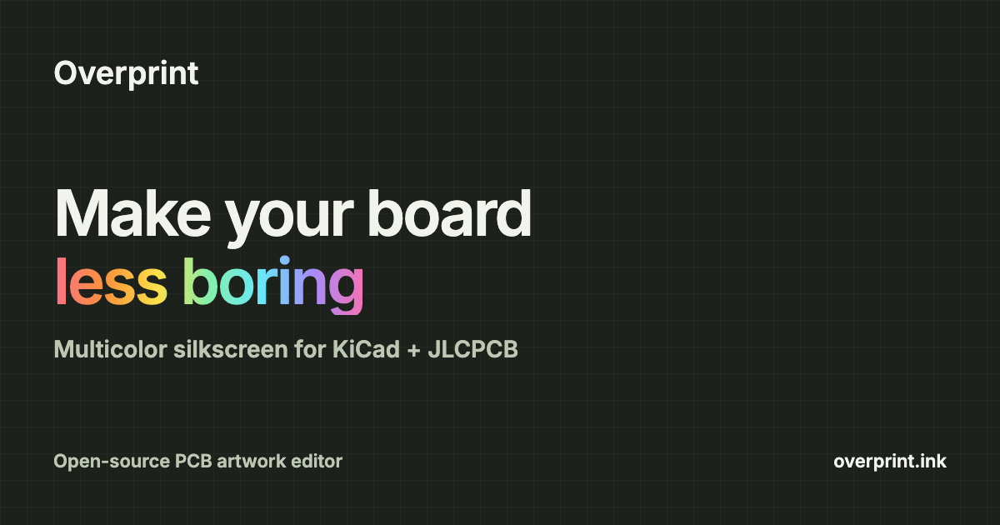

# Overprint

**Make your KiCad boards more colorful.**

Overprint is a browser-based artwork editor for full-color silkscreen on JLCPCB boards. Bring in your PCB from KiCad, add graphics or recolor the existing silkscreen, then export a manufacturing ZIP.

Your circuit stays in KiCad. Overprint handles the artwork.

**[Open Overprint](https://overprint.ink)** · [Install the KiCad plugin](https://overprint.ink/setup) · [Report a bug](https://github.com/Dirdmaster/overprint/issues)



## What you can do

- Place SVG artwork on either side of your board.
- Paint silkscreen regions and artwork with Live Paint.
- Arrange designs with layers, folders and alignment tools.
- Preview the board in 2D or with its 3D component models.
- Sync board changes from KiCad while keeping your artwork.
- Download a ZIP or send it to JLCPCB from the editor.

**Currently in alpha.** Expect rough edges. Physical print results still need validation; check both sides in JLCPCB’s Gerber Viewer before ordering. See [export details and limitations](docs/export.md).

## Try it locally

You’ll need **Bun 1.3.14**, **Node.js 22.18+** and **Python 3**. To bring in a board, you’ll also need **KiCad 10**.

```sh
git clone https://github.com/Dirdmaster/overprint.git
cd overprint
bun install --frozen-lockfile
bun start
```

Open **http://127.0.0.1:4317**.

### Bring in your board

1. In KiCad’s **Plugin and Content Manager**, open **Manage… → +**.
2. Add `https://overprint.ink/pcm/repository.json` and save.
3. Select the **Overprint** repository, install **Overprint**, then **Apply Pending Changes**.
4. Save your work and restart the PCB Editor. Open your board in KiCad 10.
5. Click **Scan for boards** in Overprint and choose your board.

The [setup guide](https://overprint.ink/setup) includes a screenshot and a manual ZIP fallback.

You can also export a file with **Tools → External Plugins → Export to Overprint** and import it manually.

The [KiCad plugin guide](packages/kicad/README.md) covers live sync and 3D models.

## Your files stay yours

Projects autosave in your browser. Download a `.overprint` project to keep a backup or move it to another browser.

There’s no account or cloud project storage. **Download ZIP** stays local. **Send ZIP** sends your manufacturing files to JLCPCB through a relay; in standalone mode, that relay runs on your own machine. [More about privacy](docs/privacy.md).

## Working on Overprint

Run `bun run dev` instead of `bun start` for development. Bun manages dependencies and tasks; Node.js runs the local HTTP server.

- [Contributing](CONTRIBUTING.md): setup, checks and pull requests.
- [Codebase guide](docs/codebase.md): where things live and how they fit together.
- [Hosting](docs/hosting.md): standalone and Cloudflare Pages.
- [DevOps](docs/devops.md): CI, deployment and releases.

## License

[MIT](LICENSE). Your PCB designs and artwork remain yours. See [third-party notices](THIRD_PARTY_NOTICES.md) for asset licenses.
