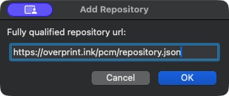

# Overprint Export — KiCad 10 alpha

## Install with a repository URL

1. Open the **KiCad project manager**, then **Plugin and Content Manager**.
2. Click **Manage… → +**, paste `https://overprint.ink/pcm/repository.json`, click **OK**, then **Save**.
3. Select **Overprint** from the repository list. Find **Overprint Export**, click **Install**, then **Apply Pending Changes**.
4. Save your work and restart all PCB Editor windows. Open your board in KiCad 10.
5. Click **Scan for boards** in Overprint and choose your board.



This is a custom repository, separate from KiCad’s official catalog. Refresh it in PCM to check for new plugin versions.

### Manual fallback

Download the plugin ZIP from [KiCad setup](https://overprint.ink/setup), keep it zipped, and choose **Install from File…** in PCM. Restart the PCB Editor after saving your work.

### File export

For a disconnected workflow, choose **Tools → External Plugins → Export to Overprint** and save the `.overprint-board` file.

The action exports the currently open board, including unsaved edits. It never saves or changes the source PCB. A closed, valid Edge.Cuts outline is required. Exports stay on your computer; nothing is uploaded.

The webapp accepts this package through Import PCB or drag/drop. The package contains native KiCad fabrication files and available component models. Add artwork and generate the JLCPCB ZIP in Overprint; the plugin package itself is not an order ZIP.

## Assembled preview

Choose **3D** in Overprint's inspector after importing a fresh package. Drag to orbit, scroll to zoom, or use Front, Back and Fit. The preview combines available component bodies with the current artwork and board geometry. Open the model status to see missing references. You can remove models from a project to reduce its size; the 2D editor stays available.

Model conversion uses KiCad's CLI and an isolated temporary board snapshot. It resolves local model paths, including STEP/IGES companions of WRL references. WRL-only and embedded-only models currently report missing. Export is limited to 60 seconds and an 8 MB GLB; missing files or conversion failures leave the 2D package usable. Models must remain visible in KiCad to be included. Saved project variables are supported; unsaved variable changes are not.

Component-model path discovery has been tested on macOS; Windows and Linux still need testing.

## Local sync

1. Install plugin **v0.1.9 or newer**, restart the PCB Editor after saving, and open your PCB. Its local server starts automatically.
2. Click **Scan for boards** on Overprint’s empty state and choose your board. No initial file export is needed.
3. After editing artwork, click **Sync** to refresh the board while keeping that artwork.

Local Overprint connects without a KiCad confirmation: `localhost` and `127.0.0.1` on ports `3000` and `4317` show board names immediately. `https://overprint.ink` is trusted by default starting with plugin 0.1.10. The configured Overprint address is also allowed. A different website asks for approval once; the plugin remembers that exact origin for later connections and restarts. Use **Tools → External Plugins → Overprint Sync** to change the configured address or stop sync.

Discovery checks only loopback ports 43190–43199. These local addresses and the configured address see board names; unknown websites see only the service version. No credentials or filesystem paths are included. Each PCB Editor uses a free port. Browser local-network permission may still be required.

Connection tokens last up to 30 minutes and stay in browser memory. Reconnecting to the configured address needs no further native approval. No export happens during startup or discovery. A manual pairing-code fallback remains available. Closing the connection window leaves the server running; **Stop sync** disables it until re-enabled there or KiCad restarts.

Sync remains an explicit refresh, not background board polling. Cancelling during approval dismisses the native prompt without granting access. A native export already running must finish before another can begin. See [privacy and transport](../../docs/privacy.md).

## Build

Run `python3 packages/kicad/build.py`. No pip dependencies are needed for the plugin or build. The plugin itself runs inside KiCad's bundled Python. The resulting ZIP follows the [official PCM layout](https://dev-docs.kicad.org/en/addons/).

The web build generates the PCM feed in `apps/web/public/pcm/` from the built plugin ZIP, including its SHA-256 and sizes. Deploying the website publishes that feed at `https://overprint.ink/pcm/repository.json`. Bump `metadata.json` and `package.json` together for each plugin release; never change an already released version. Overprint code is licensed under MIT; see the root LICENSE and THIRD_PARTY_NOTICES.md.

## Board package version 1

ZIP containing `manifest.json`, `geometry.json`, eight SVG references under `layers/`, native fabrication files under `fabrication/`, and optional component bodies under `models/`:

- Optional version-1 `fabrication` manifest lists native Gerbers and Excellon drills, copper layer count and global origin `[0, 0]`. Gerbers use KiCad's native coordinate convention (Y up), while preview coordinates use Y down. Copper layers, masks, silkscreen and outline are plotted directly by KiCad; drills include routed oval holes.
- Fabrication output uses existing zone fills and does not run DRC or establish orderability.

- `front-` and `back-` prefixes, each with `silkscreen`, `mask`, `copper`, and `fabrication` SVGs.
- Geometry includes board polygons/cutouts, pad copper polygons by side, drilled pad/slot polygons, through-via drills, and footprint IDs, references, positions and rotations.
- All coordinates use millimetres in KiCad's original frame: X right, Y down. Bounds come from the closed board polygon, excluding Edge.Cuts stroke thickness.
- Both sides retain the same coordinates. The importer mirrors back-side display with `displayX = 2 * bounds.x + bounds.width - x`. It must apply this to the whole view once, including text and holes.
- Each polygon contains an `outer` ring and `holes`. SVG uses even-odd filling. Mask paths represent openings, not the colored mask itself.
- Footprint fabrication graphics are component outlines. Native text and graphics are polygonized by KiCad. Curves are approximations; through-via drills use 64 segments. Blind/buried drills, backdrill geometry, tenting/filling and manufacturing print restrictions require further work.
- Optional version-1 `models` metadata describes `models/components.glb`, included references, missing models, status and board thickness. GLB coordinates use metres: X is board X, Z is board Y, and positive Y points toward the front, with the back board surface at Y=0. The self-contained GLB contains component bodies; the browser creates board surfaces from geometry and artwork.
- The manifest contains only the board filename stem, never the original filesystem path or native PCB file.

The ZIP is written atomically: outline or export errors preserve an existing destination. Complex silkscreen artwork may take several seconds; KiCad shows a busy cursor.

## Validation

Run the suite with KiCad's bundled Python in a logged-in desktop session:

```sh
/Applications/KiCad/KiCad.app/Contents/Frameworks/Python.framework/Versions/Current/bin/python3 -m unittest discover -s packages/kicad/tests -p 'test_*.py'
```

Tests exercise real geometry/fabrication APIs, two-sided component transforms, model failure handling, authenticated local sync, unsaved board snapshots and preservation of native files. Use your installation's bundled Python path on other platforms.

The alpha uses the [legacy pcbnew/SWIG ActionPlugin API](https://dev-docs.kicad.org/en/apis-and-binding/pcbnew/); a future IPC adapter can replace it without changing the package contract. Other KiCad major versions are deliberately rejected.

### Validate PCM metadata

Install `jsonschema` in a development virtual environment, then run:

```sh
python packages/kicad/tests/validate_package.py dist/overprint-kicad-0.1.11.zip /Applications/KiCad/KiCad.app/Contents/SharedSupport/schemas/pcm.v2.schema.json
```

Use the schema shipped with your target KiCad installation. KiCad 10 requires both `resources` and `author.contact`; empty objects are valid for this package.
